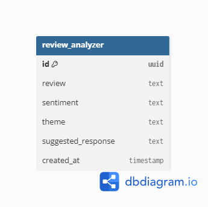

# 🏨 AI Hotel Review Classifier API

A FastAPI backend that uses the **Groq API (Llama 3.3 70B Versatile)** to analyze hotel guest reviews. The API classifies reviews by sentiment, identifies the main theme, generates a suggested management response, and provides CRUD operations for managing classified reviews.

---

## 🚀 Features

- Classify hotel reviews using an LLM
- Store classified reviews in memory
- Retrieve all reviews
- Retrieve a review by UUID
- Update an entire review (PUT)
- Partially update a review (PATCH)
- Delete reviews
- Search reviews by sentiment
- Global exception handling
- CORS enabled for React frontend

---

## 🛠 Tech Stack

- FastAPI
- Python
- Pydantic
- Groq API
- Uvicorn
- python-dotenv

---

## 📁 Project Structure

```text
review_classifier_backend/
│
├── main.py
├── model.py
├── requirements.txt
├── .env
└── README.md
```

---

# 📌 API Endpoints

| Method | Endpoint | Description |
|---------|----------|-------------|
| POST | `/classify` | Classify a hotel review |
| GET | `/read` | Get all stored reviews |
| GET | `/read/{id}` | Get a review by UUID |
| PUT | `/update/{id}` | Replace an entire review |
| PATCH | `/update/{id}` | Update selected fields of a review |
| DELETE | `/delete/{id}` | Delete a review |
| GET | `/search?sentiment=Positive` | Search reviews by sentiment |

---

# 📥 Example Request

### POST `/classify`

```json
{
  "review": "The room was clean and the staff were very helpful."
}
```

### Example Response

```json
{
  "review": [
    {
      "sentiment": "Positive",
      "theme": "Host",
      "suggested_response": "Thank you for your wonderful feedback!"
    }
  ]
}
```

---

# 🔐 Environment Variables

Create a `.env` file in the project root.

```env
GROQ_API_KEY=your_groq_api_key
```

---

# ▶️ How to Run Backend Locally

## 1. Clone the repository

```bash
git clone <repository-url>
```

Navigate into the project folder:

```bash
cd review_classifier_backend
```

---

## 2. Create a virtual environment

### Windows

```powershell
python -m venv env
```

---

## 3. Activate the virtual environment

### Windows PowerShell

```powershell
.\env\Scripts\Activate
```

If PowerShell blocks script execution, run:

```powershell
Set-ExecutionPolicy -Scope Process Bypass
```

Then activate the virtual environment again.

---

## 4. Install dependencies

```bash
pip install -r requirements.txt
```

---

## 5. Create a `.env` file

Inside the project directory create a file named:

```text
.env
```

Add your Groq API key:

```env
GROQ_API_KEY=your_actual_groq_api_key
```

---

## 6. Start the FastAPI server

```bash
uvicorn main:app --reload
```

If your main file has a different name, replace `main` with the filename.

Example:

```bash
uvicorn app:app --reload
```

---

## 7. Open the API

Swagger Documentation:

```
http://127.0.0.1:8000/docs
```

ReDoc Documentation:

```
http://127.0.0.1:8000/redoc
```

Backend Base URL:

```
http://127.0.0.1:8000
```

---

# 💻 Running with the Frontend

Your backend is configured to allow requests from:

```
http://localhost:5173
```

Start the backend:

```bash
uvicorn main:app --reload
```

Then start the React frontend:

```bash
npm install
npm run dev
```

The frontend will be available at:

```
http://localhost:5173
```

---

# 📝 Notes

- Reviews are stored in an in-memory list (`review_list`).
- All stored data is lost when the server restarts.
- Each review is assigned a UUID.
- This project demonstrates FastAPI CRUD operations, partial updates using PATCH, exception handling, and LLM integration using the Groq API.

---

# 🔮 Future Improvements

- PostgreSQL integration
- SQLAlchemy ORM
- JWT Authentication
- Docker support
- Unit testing with Pytest
- Logging
- Pagination
- Rate limiting
- Persistent database storage

---
## Week 5 — Database Integration

### Database Choice: Supabase (PostgreSQL)

We chose PostgreSQL via Supabase because our data is structured and relational by nature — every guest review has a fixed set of fields (review text, sentiment, theme, suggested response, timestamp) with no need for flexible or nested schemas. Supabase provides a free, managed PostgreSQL instance with a simple Python client SDK and no server setup required, making it a good fit for this structured, single-table use case.

### Database Schema



**Table: `review_analyzer`**

| Column | Type | Description |
|---|---|---|
| id | uuid | Primary key, auto-generated |
| review | text | The original guest review text |
| sentiment | text | Positive / Neutral / Negative |
| theme | text | Food / Host / Location / Cleanliness / Value / Experience |
| suggested_response | text | AI-generated management reply |
| created_at | timestamp | Auto-set on row creation |

### Set Up the Database

1. Create a free project at [supabase.com](https://supabase.com)
2. Go to **Project Settings → API** and copy your **Project URL** and **anon/public key**
3. In the Supabase Table Editor, create a table named `review_analyzer` with the columns listed above
4. In `backend/.env`, add:
SUPABASE_URL=your_project_url
SUPABASE_KEY=your_anon_key
GROQ_API_KEY=your_groq_key
5. Install backend dependencies and run the server:
cd backend
pip install -r requirements.txt
uvicorn main:app --reload
## 👩‍💻 Author

**Ananya Namdev**
